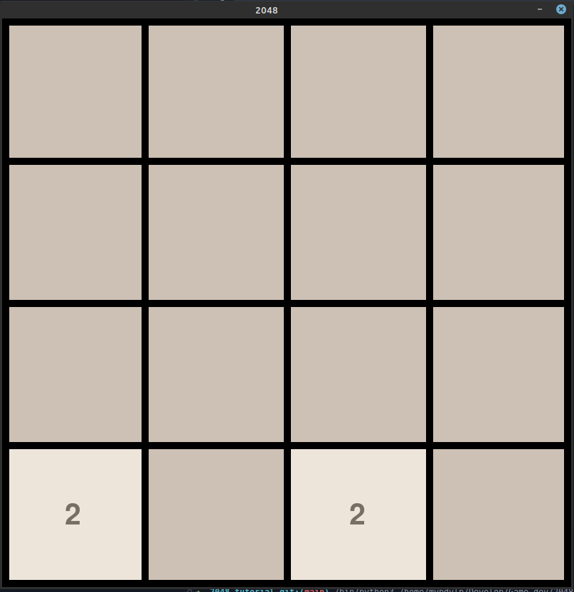

# Juego de 2048 con Pygame

## Introducción

Este proyecto implementa el popular juego **2048** utilizando la biblioteca Pygame. El objetivo del juego es combinar mosaicos con números iguales para obtener un mosaico con el número 2048. A continuación, se describen los componentes clave del proyecto:

### Uso

1. Clona este repositorio.
2. Ejecuta `main.py` utilizando Python.
3. Usa las teclas de flecha para mover los mosaicos y combinar números iguales.

¡Explora el código y diviértete programando tu propio juego de 2048! 😊

## Documentation
- Variables [aqui](variables.md)

- Tiles [aqui](tile.md)

- Funciones [here](funciones.md)
